# Business Problems and SQL Queries
This document contains the SQL queries used to solve the business problems identified during the **Retail Sales SQL Analysis** project. 

## Table of Contents

1. Retrieve Sales Made on 5 November 2022
2. Identify High-Volume Clothing Purchases
3. Calculate Total Sales by Category
4. Determine the Average Age of Beauty Customers
5. Identify High-Value Transactions
6. Analyze Transactions by Gender and Category
7. Calculate Average Monthly Sales for 2023
8. Identify the Top 5 Customers
9. Count Unique Customers by Category
10. Analyze Orders by Shift
11. Identify the Best-Selling Month of Each Year
12. Additional Business Analysis


---

## 1. Retrieve Sales Made on 5 November 2022

```sql
select * from retail_sales where sale_date='2022-11-05';
```

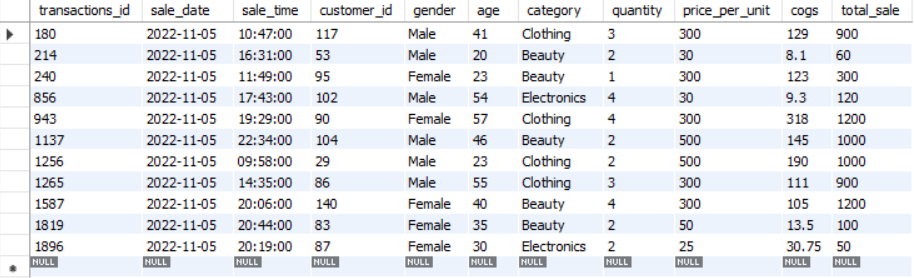

---

## 2. Identify High-Volume Clothing Purchases

```sql
select * from retail_sales where category='Clothing' and quantity>3 and month(sale_date)=11 and year(sale_date)=2022;
```

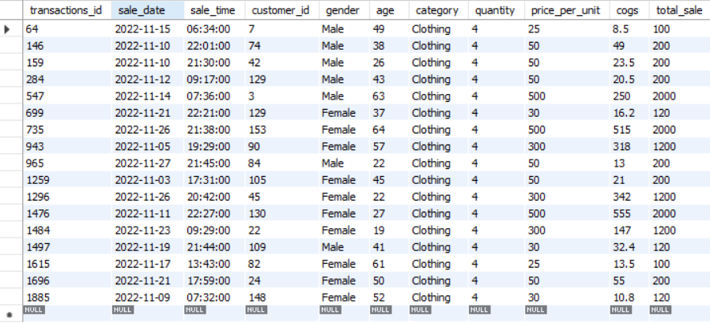


---

## 3. Calculate Total Sales by Category

```sql
select category, sum(total_sale) as Total_Sales from retail_sales group by category;
```

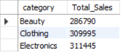

---

## 4. Determine the Average Age of Beauty Customers

```sql
select category, round(avg(age),1) as Avg_Age from retail_sales where category='Beauty';
```

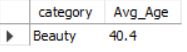

---

## 5. Identify High-Value Transactions

```sql
select * from retail_sales where total_sale>1000;
```
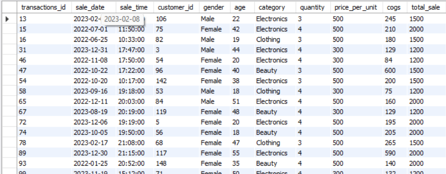

---

## 6. Analyze Transactions by Gender and Category

```sql
select category, gender, count(transactions_id) as count from retail_sales group by gender, category order by category;
```
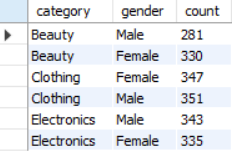

---

## 7. Calculate Average Monthly Sales for 2023

```sql
select monthname(sale_date) as 'Month', round(avg(total_sale),2) as Average 
from retail_sales where year(sale_date)=2023 group by monthname(sale_date) order by 2 desc;
```
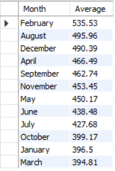

---

## 8. Identify the Top 5 Customers

```sql
select customer_id, sum(total_sale) from retail_sales group by customer_id order by 2 desc limit 5;
```
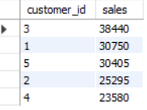

---

## 9. Count Unique Customers by Category

```sql
select category, count(distinct customer_id) unq_cust from retail_sales group by category;
```
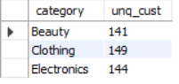

---

## 10. Analyze Orders by Shift

```sql
select 	case
			when hour(sale_time)<12 then 'Morning'
			when hour(sale_time)<17 then 'Afternoon'
			else 'Evening'
		end as shift, 
        count (*) as Total_Orders from retail_sales group by 1;
```
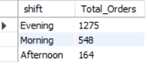

---

## 11. Identify the Best-Selling Month of Each Year

```sql
select Month, year, Tot_sale from(
select monthname(sale_date) as 'Month', year(sale_date) as 'year', sum(total_sale) Tot_sale,
		rank() over( 
        partition by year(sale_date) order by sum(total_sale) desc
        ) as 'rnk'
        from retail_sales group by 1, 2) as Highest_sale where rnk=1;
```
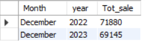

---

# Additional Analysis

Beyond the core business questions, two additional analyses were performed to gain deeper insights into customer spending patterns and category-wise revenue distribution.

## 1. Top Spending Customers by Category

```sql
select customer_id, category, sales, rnk as 'RANK' from (
		select customer_id, category, sum(total_sale) sales, rank() over(
        partition by category order by sum(total_sale) desc
        ) as rnk from retail_sales group by customer_id, category
        ) as ranked_sales where rnk in (1,2,3);
```
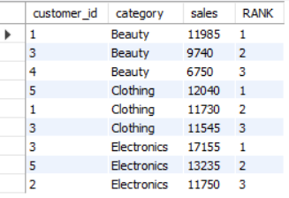

---

## 2. Revenue Contribution by Category

```sql
select category, sum(total_sale) revenue, round(sum(total_sale)/(
									select sum(total_sale) from retail_sales
                                    )*100,2) as share_percentage 
from retail_sales group by category;
```
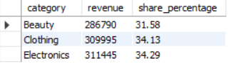

---
